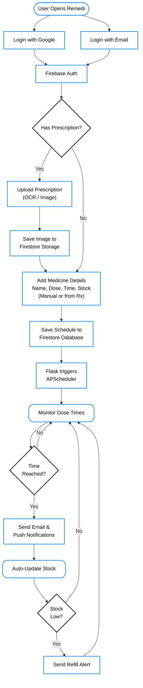

```mermaid
flowchart TD
    %% Node Definitions
    Start([User Opens Remedi])
    
    %% Login
    LoginG["Login with Google"]
    LoginE["Login with Email"]
    
    %% Auth
    Auth["Firebase Auth"]
    
    %% Prescription Logic
    choice{"Has Prescription?"}
    UploadRx["Upload Prescription<br/>(OCR / Image)"]
    StoreRx["Save Image to<br/>Firestore Storage"]
    
    %% Main Input (Quoted text to fix parser error)
    AddMed["Add Medicine Details<br/>Name, Dose, Time, Stock<br/>(Manual or from Rx)"]
    
    %% Backend & Scheduling
    StoreData["Save Schedule to<br/>Firestore Database"]
    Scheduler["Flask triggers<br/>APScheduler"]
    
    %% Monitoring
    Monitor["Monitor Dose Times"]
    TimeCheck{"Time<br/>Reached?"}
    
    %% Notifications
    SendNotif["Send Email &<br/>Push Notifications"]
    UpdateStock["Auto-Update Stock"]
    
    %% Stock Checks
    StockCheck{"Stock<br/>Low?"}
    Refill["Send Refill Alert"]

    %% Connections
    Start --> LoginG
    Start --> LoginE
    LoginG --> Auth
    LoginE --> Auth
    Auth --> choice
    
    %% Path 1: Prescription Upload
    choice -- Yes --> UploadRx
    UploadRx --> StoreRx
    StoreRx --> AddMed
    
    %% Path 2: Manual Entry
    choice -- No --> AddMed
    
    %% Workflow continues
    AddMed --> StoreData
    StoreData --> Scheduler
    Scheduler --> Monitor
    Monitor --> TimeCheck
    
    %% Monitoring Logic
    TimeCheck -- No --> Monitor
    TimeCheck -- Yes --> SendNotif
    
    SendNotif --> UpdateStock
    UpdateStock --> StockCheck
    
    StockCheck -- Yes --> Refill
    StockCheck -- No --> Monitor
    Refill --> Monitor

    %% Styling
    classDef standardNode fill:#fff,stroke:#1E90FF,stroke-width:2px,color:#000;
    classDef roundedNode fill:#fff,stroke:#1E90FF,stroke-width:2px,rx:15,ry:15,color:#000;
    classDef diamondNode fill:#fff,stroke:#000,stroke-width:2px,color:#000;

    class LoginG,LoginE,Auth,AddMed,StoreData,Scheduler,SendNotif,Refill,UploadRx,StoreRx standardNode;
    class Start,Monitor,UpdateStock roundedNode;
    class TimeCheck,StockCheck,choice diamondNode;
```
